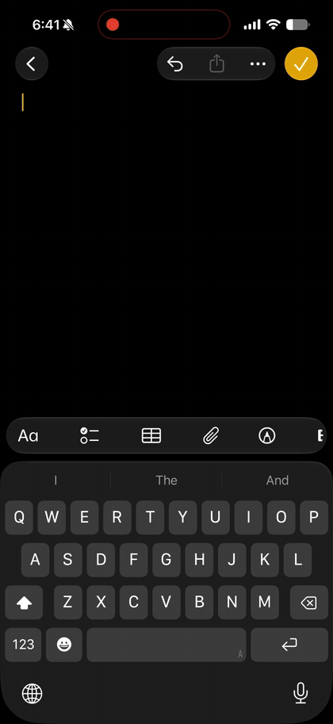

# Obadh for iOS

**Obadh** (অবাধ) is a project to modernize Bangla typing across all major
platforms. At its core is
[obadh_engine](https://github.com/nsssayom/obadh_engine), a deterministic
Roman-to-Bangla transliteration engine and runtime SDK written in Rust — fast,
accurate, dictionary-free at the core, with FST autocorrect and n-gram
autosuggest as separable layers. This repository is the **iOS deliverable**: a
native keyboard for iPhone and iPad built on that engine.

You type roman, it composes Bangla live, and everything runs on your device.

<p align="center">
  
  &nbsp;&nbsp;
  
</p>

<p align="center">
  
</p>

## What it does

- **Live transliteration as real text.** The word you are typing is ordinary
  text in the field, not an IME composition — the cursor moves freely,
  mid-text editing just works, and switching keyboards mid-word keeps the
  word. ([why](docs/text-composition.md))
- **Autocorrect that knows its place.** The ribbon shows the deterministic
  output first, then engine-ranked corrections. Optional auto-insert commits a
  correction on space only when a strict, measurable confidence gate passes —
  and tapping your own quoted spelling protects it forever.
  ([the gate](docs/autocorrect.md))
- **Next-word suggestions and personal learning**, entirely on device, from
  the engine's bundled n-gram model plus a fingerprint-validated personal
  overlay.
- **Emoji, the way you actually say it.** Inline emoji suggestions for the
  word being typed (ভালোবাসা → ❤️), and a full emoji panel with English and
  Bangla search. ([the pipeline](docs/emoji.md))
- **Bangla numerals and punctuation** on the iOS layer: ০–৯ on the number pad,
  `৳` and `।` (dari) on the punctuation pages, quick double-space for dari,
  Apple-style smart punctuation.
- **Indistinguishable from the native keyboard.** Geometry and color are
  measured against Apple's keyboard across device classes, host presentations,
  and appearances, and enforced by a screenshot-measurement test suite.
  ([the measured model](docs/native-parity.md))
- **Native-feeling haptics**, tuned on device with Core Haptics.

## Privacy

Everything is local. No network, no telemetry, no analytics — the extension
never talks to anything but the text field. Full Access is requested only
because iOS gates keyboard-extension haptics (and App Group access) behind it.

## Getting started

```bash
git clone https://github.com/nsssayom/obadh-ios && cd obadh-ios
./scripts/bootstrap.sh
./scripts/install-device.sh   # builds Release and installs on your device
```

Requirements: Xcode 26+, [XcodeGen](https://github.com/yonaskolb/XcodeGen), a
Rust toolchain. The app walks you through enabling the keyboard after install.
Full details, build configurations, and the engine-bump workflow:
[docs/build-and-release.md](docs/build-and-release.md).

## How it's built

The engine owns transliteration, correction ranking, and suggestion lookup;
the iOS layer owns touch, layout, text-proxy mutation, haptics, and policy.
They meet at a deliberately thin C ABI that moves UTF-8 buffers and packed
records — nothing else.

| Doc | Covers |
|---|---|
| [architecture.md](docs/architecture.md) | Targets, the engine boundary, the composer boundary, state and storage |
| [text-composition.md](docs/text-composition.md) | Why not marked text, touch routing, the ribbon, space and dari, backspace |
| [native-parity.md](docs/native-parity.md) | The measured model of iOS keyboard presentation and how parity is enforced |
| [autocorrect.md](docs/autocorrect.md) | The engine/client policy split and the auto-insert confidence gate |
| [emoji.md](docs/emoji.md) | The CLDR + colloquial data pipeline, ranking, search |
| [testing.md](docs/testing.md) | Unit tests, engine integration tests, the parity suite, mouse-free simulator automation |
| [build-and-release.md](docs/build-and-release.md) | Setup, the Rust bridge, device install, build stamping |

For the engine itself — the transliteration model, the artifacts, the
philosophy — read the
[obadh_engine README](https://github.com/nsssayom/obadh_engine).

## Project layout

```
ObadhApp/            The containing app (SwiftUI): first-run setup, settings
ObadhKeyboard/       The UIInputViewController keyboard extension
Shared/Sources/      Keyboard UI, composer, design tokens, emoji stores
                     (pure parts also build as the ObadhKeyboardCore SwiftPM
                     library for off-device tests)
rust/ObadhBridge/    Static Rust shim over obadh_engine's C ABI
Resources/           Bundled engine artifacts and emoji indexes
Tests/               Engine integration tests (real xcframework, real data)
scripts/             Bootstrap, device install, parity suite, data pipeline
```

The Xcode project is generated from `project.yml` — edit that, never the
`.xcodeproj`.

## Testing

Behavior is verified against the real thing at every layer: unit tests run
against the real generated artifacts, integration tests link the real
xcframework with pinned data fingerprints, and visual parity is gated by
measured screenshots, not eyeballs. Debug builds carry the instrumentation
that makes this scriptable; none of it exists in Release.
[docs/testing.md](docs/testing.md) has the map.
